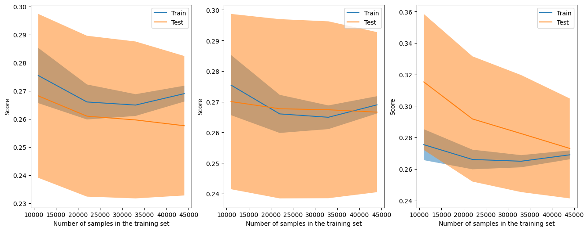

# Predicting Airbnb Rental Prices


```python
import pandas as pd
import numpy as np
import matplotlib.pyplot as plt
import seaborn as sns
import scipy as sp
import scipy.stats as st
%matplotlib inline
from sklearn.model_selection import train_test_split, cross_val_score, learning_curve
from sklearn.model_selection import RandomizedSearchCV, LearningCurveDisplay, ShuffleSplit
from sklearn.metrics import mean_squared_error
from sklearn.ensemble import RandomForestRegressor
from sklearn.linear_model import LinearRegression, SGDRegressor
from sklearn.svm import SVR
from sklearn import tree
```

# Overview
---
The goal of this project is the explore the different predictive capabailities of the different regressor algorithms in the sklearn library. I mainly learned Support Vector Machine and Random Forest for Classification tasks and wanted to learn how to use them for Regression tasks.

The airbnb dataset of mainly cateogircal variables with some continuous variables thrown in. The goal will be to find which variables have the strongest impact on pricing and build several regression models with those variables. I'll be looking at the Root Mean Square Error as the guide for model perofmrance.

I'll follow the standard procedures:
* Inspect the data for potential errors such as miskeys
* Take care of any null values
* visualize and explore the data for potential variable selection
* Build several regression models and compare performances
* Utilize learning curves and cross-validation to pinpoint the best model for the job

Along the way, because there are many categorical variables, I'll be using statistical testing to get a feel for any differences in the mean of the aribnb prices.

---

# Data Prep

---
<u> Goals </i>
* Find miskeyed outliers
* Impute null variables
* Transform variables for scaling or exploration purposes

---


```python
df = pd.read_csv('AB_NYC_2019.csv')
df.info()
```

    <class 'pandas.core.frame.DataFrame'>
    RangeIndex: 48895 entries, 0 to 48894
    Data columns (total 16 columns):
     #   Column                          Non-Null Count  Dtype  
    ---  ------                          --------------  -----  
     0   id                              48895 non-null  int64  
     1   name                            48879 non-null  object 
     2   host_id                         48895 non-null  int64  
     3   host_name                       48874 non-null  object 
     4   neighbourhood_group             48895 non-null  object 
     5   neighbourhood                   48895 non-null  object 
     6   latitude                        48895 non-null  float64
     7   longitude                       48895 non-null  float64
     8   room_type                       48895 non-null  object 
     9   price                           48895 non-null  int64  
     10  minimum_nights                  48895 non-null  int64  
     11  number_of_reviews               48895 non-null  int64  
     12  last_review                     38843 non-null  object 
     13  reviews_per_month               38843 non-null  float64
     14  calculated_host_listings_count  48895 non-null  int64  
     15  availability_365                48895 non-null  int64  
    dtypes: float64(3), int64(7), object(6)
    memory usage: 6.0+ MB
    

---

The dataset contains 48,895 samples. Ten variables are either integer or float types and six are objects. There seems to be some redunadant information. For instance, latitude and longitude combined along with neighbourhood_group and neighbourhood are all different scaled perspectives of location. I suspect the model won't need redundant information, so whichever is the easiest to communicate to a client will win a spot in the model

### Null Values


```python
df.isna().sum()
```


    id                                    0
    name                                 16
    host_id                               0
    host_name                            21
    neighbourhood_group                   0
    neighbourhood                         0
    latitude                              0
    longitude                             0
    room_type                             0
    price                                 0
    minimum_nights                        0
    number_of_reviews                     0
    last_review                       10052
    reviews_per_month                 10052
    calculated_host_listings_count        0
    availability_365                      0
    dtype: int64


The greatest amount of nulls belong to last_review and reviews_per_month. The latter may be the easiest of the two to impute since we can look at the distribution and infer what we should do. 

name and host_name are the smallest and will require some inspection to find the best course of action.

### Imputing Missing Host Names


```python
#get count of id's with no host name
df[ df['host_name'].isnull()]['host_id'].value_counts()
```


    159156636    3
    32722063     2
    526653       1
    26138712     1
    119609345    1
    177146433    1
    415290       1
    100971588    1
    5300585      1
    7822683      1
    7779204      1
    39608626     1
    5162530      1
    33134899     1
    24576978     1
    23077718     1
    919218       1
    228750026    1
    Name: host_id, dtype: int64


---

Since ID's 159156636 and 32722063 have repeat business, we should find matches for them. All the host id's with a count of 1 can be labeled as 'unknown.' 

---


```python
print("Results for host_id 159156636")
print(df[ df['host_id'] == 159156636]['host_name'])
print('--------------------------------')
print("Results for host_id 32722063")
print(df[ df['host_id'] == 32722063]['host_name'])
```

    Results for host_id 159156636
    27962    NaN
    28042    NaN
    28274    NaN
    Name: host_name, dtype: object
    --------------------------------
    Results for host_id 32722063
    8163    NaN
    8852    NaN
    Name: host_name, dtype: object
    


```python
#get indices of specific host_id
#variable names are the replacement names
zakk = df[ df['host_id'] == 159156636]['host_name'].index.to_list()
faulkner = df[ df['host_id'] == 32722063]['host_name'].index.to_list()
```


```python
#replace NaN with Zakk
for i in zakk:
    df.iloc[i, 3] = 'Zakk'

#replace NaN with Faulkner
for i in faulkner:
    df.iloc[i, 3] = "Faulkner"
```

---
Because the rest of the missing values were one-offs, I'll impute them with "uknown" rather than spend time coming up with names that don't match the rest of the names in the data set.

---


```python
#get indices of host_names with null values
null_names_ind = df[ df['host_name'].isnull()].index.to_list()

#replace singular host_id's with unknown
for num in range(len(null_names_ind)):
    df.iloc[null_names_ind[num], 3] = 'unknown'
```

### Impute missing airbnb listing name


```python
df.iloc[:,1]
```


    0                       Clean & quiet apt home by the park
    1                                    Skylit Midtown Castle
    2                      THE VILLAGE OF HARLEM....NEW YORK !
    3                          Cozy Entire Floor of Brownstone
    4         Entire Apt: Spacious Studio/Loft by central park
                                   ...                        
    48890      Charming one bedroom - newly renovated rowhouse
    48891        Affordable room in Bushwick/East Williamsburg
    48892              Sunny Studio at Historical Neighborhood
    48893                 43rd St. Time Square-cozy single bed
    48894    Trendy duplex in the very heart of Hell's Kitchen
    Name: name, Length: 48895, dtype: object


---

The name attribute refers to the title of the air bnb ad. Based on the above samples, the text in this variables functions to to provide an quick, attractive description of the listing to catch a client's interest. Since most of the listing name's describe the room, we can replace the missing name entries with the generic descriptions provided by the room_type.

---


```python
#get indices of missing listing name
null_name = df[ df['name'].isna()].index.to_list() #get indices of missing listing name

for i in range(len(null_name)):
    df.iloc[null_name[i], 1] = df.room_type[null_name[i]] #replace with room description
```

### Imputing Reviews Per Month


```python
sns.histplot(df, x = 'reviews_per_month', kde = True)
```


    <Axes: xlabel='reviews_per_month', ylabel='Count'>


    

    


```python
df["reviews_per_month"].value_counts(ascending = False)
```


    0.02     919
    0.05     893
    1.00     893
    0.03     804
    0.16     667
            ... 
    9.53       1
    9.74       1
    6.06       1
    8.25       1
    10.54      1
    Name: reviews_per_month, Length: 937, dtype: int64


```python
len(df[ df['reviews_per_month'] < 1])
```


    22042


---
From the histogram and the count of values, it's clear the a lot of the monthly averages cluster around 0. In fact, we have 22,042 reviews that average less than 1 review per month. 

As a reminder, this variable contains over 10,000 null values. The standard procedure for imputing the data is to use the mean or median. The problem with this approach is that it will create a strange spike in the middle of the distribution, creating problems for statistical inferences for the machine.

The approach I like to take is to mimic the distribution as much as possible. Since a lot of the data clusters towards 0, I will create a randomly generated sample of 10,000 values ranging from the minimum value to the seventy-fifth quartile.

---


```python
df['reviews_per_month'].describe()
```


    count    38843.000000
    mean         1.373221
    std          1.680442
    min          0.010000
    25%          0.190000
    50%          0.720000
    75%          2.020000
    max         58.500000
    Name: reviews_per_month, dtype: float64


```python
ints = np.random.default_rng().uniform(0.01, 2.02, 10085)

reviews_indices = df[ df['reviews_per_month'].isna()].index.to_list()

for i in range(len(reviews_indices)):
    df.iloc[reviews_indices[i], 13] = ints[i]
```


```python
sns.histplot(df, x = 'reviews_per_month', kde = True)
```


    <Axes: xlabel='reviews_per_month', ylabel='Count'>


    

    


 ### Creating Availability Category


```python
df['availability_365'].value_counts()
```


    0      17533
    365     1295
    364      491
    1        408
    89       361
           ...  
    195       26
    183       24
    196       24
    181       23
    202       20
    Name: availability_365, Length: 366, dtype: int64


The availability_365 variable describes how often the listing is available for rent. There are 366 unique values in this category, one for each day in a leap year. Rather than deal with any visualisations that handles each day of a leap year, we can create for four categories based on availability. This will help with statistical testing and inference.

For properties available less than or equal three months out of the year, we'll label these rare. The next three months, uncommon. The nex three, frequent. And lastly, year-round.


```python
df['availability'] = pd.cut(x = df['availability_365'], bins = [0,90,180, 270,365], 
                            include_lowest = True, labels = ['rare', 'uncommon', 'frequent', 'year-round'])
```

### Creating Price Categories


```python
df['price_category'] = pd.cut(x = df['price'], bins = [0, 69,106, 175, 10000], labels = [0,1,2,3])
df['price_category']
```


    0        2
    1        3
    2        2
    3        1
    4        1
            ..
    48890    1
    48891    0
    48892    2
    48893    0
    48894    1
    Name: price_category, Length: 48895, dtype: category
    Categories (4, int64): [0 < 1 < 2 < 3]


### Outliers


```python
df.describe()
```


<div>
<style scoped>
    .dataframe tbody tr th:only-of-type {
        vertical-align: middle;
    }

    .dataframe tbody tr th {
        vertical-align: top;
    }

    .dataframe thead th {
        text-align: right;
    }
</style>
<table border="1" class="dataframe">
  <thead>
    <tr style="text-align: right;">
      <th></th>
      <th>id</th>
      <th>host_id</th>
      <th>latitude</th>
      <th>longitude</th>
      <th>price</th>
      <th>minimum_nights</th>
      <th>number_of_reviews</th>
      <th>reviews_per_month</th>
      <th>calculated_host_listings_count</th>
      <th>availability_365</th>
    </tr>
  </thead>
  <tbody>
    <tr>
      <th>count</th>
      <td>4.889500e+04</td>
      <td>4.889500e+04</td>
      <td>48895.000000</td>
      <td>48895.000000</td>
      <td>48895.000000</td>
      <td>48895.000000</td>
      <td>48895.000000</td>
      <td>48895.000000</td>
      <td>48895.000000</td>
      <td>48895.000000</td>
    </tr>
    <tr>
      <th>mean</th>
      <td>1.901714e+07</td>
      <td>6.762001e+07</td>
      <td>40.728949</td>
      <td>-73.952170</td>
      <td>152.720687</td>
      <td>7.029962</td>
      <td>23.274466</td>
      <td>1.299047</td>
      <td>7.143982</td>
      <td>112.781327</td>
    </tr>
    <tr>
      <th>std</th>
      <td>1.098311e+07</td>
      <td>7.861097e+07</td>
      <td>0.054530</td>
      <td>0.046157</td>
      <td>240.154170</td>
      <td>20.510550</td>
      <td>44.550582</td>
      <td>1.527313</td>
      <td>32.952519</td>
      <td>131.622289</td>
    </tr>
    <tr>
      <th>min</th>
      <td>2.539000e+03</td>
      <td>2.438000e+03</td>
      <td>40.499790</td>
      <td>-74.244420</td>
      <td>0.000000</td>
      <td>1.000000</td>
      <td>0.000000</td>
      <td>0.010000</td>
      <td>1.000000</td>
      <td>0.000000</td>
    </tr>
    <tr>
      <th>25%</th>
      <td>9.471945e+06</td>
      <td>7.822033e+06</td>
      <td>40.690100</td>
      <td>-73.983070</td>
      <td>69.000000</td>
      <td>1.000000</td>
      <td>1.000000</td>
      <td>0.240000</td>
      <td>1.000000</td>
      <td>0.000000</td>
    </tr>
    <tr>
      <th>50%</th>
      <td>1.967728e+07</td>
      <td>3.079382e+07</td>
      <td>40.723070</td>
      <td>-73.955680</td>
      <td>106.000000</td>
      <td>3.000000</td>
      <td>5.000000</td>
      <td>0.810309</td>
      <td>1.000000</td>
      <td>45.000000</td>
    </tr>
    <tr>
      <th>75%</th>
      <td>2.915218e+07</td>
      <td>1.074344e+08</td>
      <td>40.763115</td>
      <td>-73.936275</td>
      <td>175.000000</td>
      <td>5.000000</td>
      <td>24.000000</td>
      <td>1.798407</td>
      <td>2.000000</td>
      <td>227.000000</td>
    </tr>
    <tr>
      <th>max</th>
      <td>3.648724e+07</td>
      <td>2.743213e+08</td>
      <td>40.913060</td>
      <td>-73.712990</td>
      <td>10000.000000</td>
      <td>1250.000000</td>
      <td>629.000000</td>
      <td>58.500000</td>
      <td>327.000000</td>
      <td>365.000000</td>
    </tr>
  </tbody>
</table>
</div>


My intuition led me to believe that minimum_nights had a mis-key that became an outlier. A minimum night requirement of 1250 seemed absurd. I couldn't imagine anyone requiring their listing to be rented for 3.5 years. Four months seemed like a more reasonable requirement. However, I found that there were plenty of listings with minimum night requirements ranging between 500 to 999 nights and left the entry alone.

The rest of extreme values in price, number of reviews, reviews per month, calculated host listings, are reasonable. There's no reason why a listing couldn't have 600 reviews while the rest get far less, especially if it's popular. Additionally, one person could be a sucessfull property manager and own 327 properties, especailly if s/he owns a several hostels.

The only thing I'll do is transform the price for model building purposes, and reviews_per_month for data analysis purposes.


```python
sns.histplot(df, x = 'price')
```


    <Axes: xlabel='price', ylabel='Count'>


    

    


```python
df['log_price'] = np.log1p(df['price'])
sns.histplot(df, x = 'log_price')
```


    <Axes: xlabel='log_price', ylabel='Count'>


    

    


```python
print("Kurtosis: ", st.kurtosis(df['log_price']))
print("Skew: ", st.skew(df['log_price']))
```

    Kurtosis:  1.7424217910015383
    Skew:  0.5530875779274399
    

The distribution approaches normality. However, a normal distribution has a kurtosis of 3. Ours is 1.7. We have a somewhat small peak with long tails on either side that skews slightly right. This makes sense considering that amount of right-tailed outliers that gave the long right-tailed distribution on the untransoformed plot.

What difference does this make in our visual analysis? Compare the boxplots of non-log (on the left) and log_price (on the right).

Transforming the price by scales the data down while preserving the distances between the data points.


```python
fig, ax = plt.subplots(1,2, figsize = (11.7, 8.7))
sns.boxplot(df,x = 'neighbourhood_group', y = 'price', ax = ax[0]);
sns.boxplot(df,x = 'neighbourhood_group', y = 'log_price', ax = ax[1]);

plt.show()
```


    

    


```python
df['log_reviews_month'] = np.log1p(df['reviews_per_month'])
sns.histplot(df, x = 'log_reviews_month', kde = True)
```


    <Axes: xlabel='log_reviews_month', ylabel='Count'>


    

    


```python
sns.histplot(df, x = 'log_reviews_month', kde = True)
```


    <Axes: xlabel='log_reviews_month', ylabel='Count'>


    

    


# Exploratory Data Analysis

### Price Distribution by Neighbourhood Group


```python
fig, ax = plt.subplots(1,2, figsize = (11.7, 8.7))
sns.barplot(df, x = 'neighbourhood_group', y = 'price', errorbar = None, ax = ax[0])
sns.boxplot(df,x = 'neighbourhood_group', y = 'log_price', ax = ax[1])

```


    <Axes: xlabel='neighbourhood_group', ylabel='log_price'>


    

    


```python
brooklyn_log = df[ df['neighbourhood_group'] == 'Brooklyn']['log_price'].to_list()
manhatten_log = df[ df['neighbourhood_group'] == 'Manhattan']['log_price'].to_list()
queens_log = df[ df['neighbourhood_group'] == 'Queens']['log_price'].to_list()
staten_log = df[ df['neighbourhood_group'] == 'Staten Island']['log_price'].to_list()
bronx_log = df[ df['neighbourhood_group'] == 'Bronx']['log_price'].to_list()
```


```python
st.levene(brooklyn_log, manhatten_log, queens_log, staten_log, bronx_log)
```


    LeveneResult(statistic=30.371197082258906, pvalue=2.767946751198571e-25)


---

With a pvalue of 2.8e-25, we have rejected the null hypohtesis in favor of the alternative. Our variances are not equal and we therefore can't use the standard ANOVA test.

However, we can use the kruskal test.

---


```python
st.kruskal(brooklyn_log, manhatten_log, queens_log, staten_log, bronx_log)
```


    KruskalResult(statistic=7027.24083560648, pvalue=0.0)


---

With a pvalue of 0, we reject the null hypothesis. The means of our data are different. Now we can write a loop to find out where our differences are. Normally, a Tukey test could do this for us simply, or a t-test. However, even though our data distribution approaches normality (see below), the long-tails on either side and numerous peaks clustering around the center will prevent our data from being regarded as normally distributed. There are too many samples for an accurate shapiro test. Therefore, in lieu of a t-test, we'll use the non-parametric Mann-Whitney test.

---


```python
fig, ax = plt.subplots(3,2)

sns.histplot(brooklyn_log, ax= ax[0, 0])
sns.histplot(manhatten_log, ax= ax[0, 1])
sns.histplot(queens_log, ax= ax[1, 0])
sns.histplot(staten_log, ax= ax[1, 1])
sns.histplot(bronx_log, ax= ax[2, 0])
```


    <Axes: ylabel='Count'>


    

    


```python
data = [brooklyn_log, manhatten_log, queens_log, staten_log, bronx_log]
places = ['Brooklyn', 'Manhatten', 'Queens', 'Staten Island',  'Bronx']

for i in range(len(data)-1):
    for j in range(i+1, 5):
        res = st.mannwhitneyu(data[i], data[j])
        if res.pvalue < .05:
            print("Difference in means between " + str(places[i]) + " and " + str(places[j])
                    + ". pvalue: " + str(res.pvalue))
        else:
            print("\nNo difference in mean between" + str(places[i]) + " and " + str(places[j])
                  + ". pvalue: " + str(res.pvalue) + "\n")
```

    Difference in means between Brooklyn and Manhatten. pvalue: 0.0
    Difference in means between Brooklyn and Queens. pvalue: 2.1432196923384333e-100
    Difference in means between Brooklyn and Staten Island. pvalue: 4.331177711968789e-10
    Difference in means between Brooklyn and Bronx. pvalue: 1.7899515875168793e-64
    Difference in means between Manhatten and Queens. pvalue: 0.0
    Difference in means between Manhatten and Staten Island. pvalue: 8.423744695257567e-69
    Difference in means between Manhatten and Bronx. pvalue: 3.4778188463018754e-269
    
    No difference in mean betweenQueens and Staten Island. pvalue: 0.7163566408535452
    
    Difference in means between Queens and Bronx. pvalue: 1.3674613171404386e-11
    Difference in means between Staten Island and Bronx. pvalue: 0.00130051257738995
    

---

The only two neighborhoods that don't have differences in means of log_price are Queens and Staten Island. Neighbourhood Group will more than likely make a great candidate for a regression model. Next, calculating the effect size between the groups can give us a clue how much the differences matter. Because the data for each neighbourhood isn't normally distributed and none of them have equal variance, cohen's d will provide an accurate measures. Instead, cliff's delta offers a nonparametric approach to effect size.

---


```python
from cliffs_delta import cliffs_delta
```


```python
def cliffs_comparisons(data, places):
    for i in range(len(data)-1):
        for j in range(i+1, len(data)):
            print(f"Effect Size Between {places[i]} and {places[j]}")
            print(cliffs_delta(data[i], data[j]) )
            print("----------------\n")
```


```python
data = [brooklyn_log, manhatten_log, queens_log, staten_log, bronx_log]
places = ['Brooklyn', 'Manhatten', 'Queens', 'Staten Island',  'Bronx']
cliffs_comparisons(data, places)
```

    Effect Size Between Brooklyn and Manhatten
    (-0.3747950847642488, 'medium')
    ----------------
    
    Effect Size Between Brooklyn and Queens
    (0.18466228523783632, 'small')
    ----------------
    
    Effect Size Between Brooklyn and Staten Island
    (0.18826512323584918, 'small')
    ----------------
    
    Effect Size Between Brooklyn and Bronx
    (0.3042122302250114, 'small')
    ----------------
    
    Effect Size Between Manhatten and Queens
    (0.5379408822983647, 'large')
    ----------------
    
    Effect Size Between Manhatten and Staten Island
    (0.5284552251838684, 'large')
    ----------------
    
    Effect Size Between Manhatten and Bronx
    (0.627851057654464, 'large')
    ----------------
    
    Effect Size Between Queens and Staten Island
    (0.011210749600883498, 'negligible')
    ----------------
    
    Effect Size Between Queens and Bronx
    (0.12902423739073632, 'negligible')
    ----------------
    
    Effect Size Between Staten Island and Bronx
    (0.11135957615685735, 'negligible')
    ----------------
    
    

---
Out of the ten tests, only 3 had a negligible difference in their listing prices. Four tests had differences larger than small, and three tests were small. Essentially, when Brooklyn's prices were compares to the rest, it mattered whether you would stay in Brooklyn or not to a large degree. Whereas it didn't matter if you were going to stay in Queens or Staten Island, Queens or Bronx, or Staten Island or Bronx. 70% of the time, we would have to take a moment to consider if we were choosing one neighbourhood group of the other based solely on the listing price.

Because of this, the airbnb host would need to think like a customer when considering their pricing in order to stat competitive. Therefore, neigbourhood group would be an important factor in our model.

---

## Availability 365

---
Recall that this variable divded into four cateogires. Rare represents availability 0-90 days, uncommon 91-180 days, frequent 181-270 days, and year-round 271 -365.

---


```python
sns.violinplot(df, x = 'availability', y = 'log_price')
```


    <Axes: xlabel='availability', ylabel='log_price'>


    

    


```python
sns.histplot(df, x = 'log_price', hue = 'availability')
```


    <Axes: xlabel='log_price', ylabel='Count'>


    

    


```python
avail = ['rare', 'uncommon', 'frequent', 'year-round']

for i in range(len(avail)):
    print(f"Kurtotsis of {avail[i]}: {st.kurtosis(df[ df['availability'] == avail[i]]['price'])}")
    print(f"Skew of {avail[i]}: {st.kurtosis(df[ df['availability'] == avail[i]]['price'])}")
    print("\n")
```

    Kurtotsis of rare: 1017.3414005203923
    Skew of rare: 1017.3414005203923
    
    
    Kurtotsis of uncommon: 328.91044448398554
    Skew of uncommon: 328.91044448398554
    
    
    Kurtotsis of frequent: 447.1958056222395
    Skew of frequent: 447.1958056222395
    
    
    Kurtotsis of year-round: 289.7154450578424
    Skew of year-round: 289.7154450578424
    
    
    

---

For the most part, the different availability groups have similar distribution spreads. we can see that in the violin plots and histrogram. Where they differ is in the height of the histogram distribution. The rare availability category tend to have more right-bound outliers (that is, more homes that are extremely expensive). Additionally, the Rare Availability category skews right, having more properties than the other categories.

----


```python
rare = df[ df['availability'] == 'rare']['log_price'].to_list()
uncommon = df[ df['availability'] == 'uncommon']['log_price'].to_list()
frequent = df[ df['availability'] == 'frequent']['log_price'].to_list()
yearly = df[ df['availability'] == 'year-round']['log_price'].to_list()
```


```python
data = [rare, uncommon, frequent, yearly]
avail = ['rare', 'uncommon', 'frequent', 'year-round']

for i in range(len(data)-1):
    for j in range(i+1, len(data)):
        res = st.mannwhitneyu(data[i], data[j])
        if res.pvalue < .05:
            print("Difference in means between " + str(avail[i]) + " and " + str(avail[j])
                    + ". pvalue: " + str(res.pvalue))
        else:
            print("\nNo difference in mean between" + str(avail[i]) + " and " + str(avail[j])
                  + ". pvalue: " + str(res.pvalue) + "\n")
```

    Difference in means between rare and uncommon. pvalue: 4.608532885421008e-13
    Difference in means between rare and frequent. pvalue: 7.506380533778027e-59
    Difference in means between rare and year-round. pvalue: 2.0062289032353753e-48
    Difference in means between uncommon and frequent. pvalue: 6.204898319625922e-13
    Difference in means between uncommon and year-round. pvalue: 0.00018566318327457117
    Difference in means between frequent and year-round. pvalue: 0.00011035181140840841
    


```python
cliffs_comparisons(data, avail)
```

    Effect Size Between rare and uncommon
    (-0.06243266025560361, 'negligible')
    ----------------
    
    Effect Size Between rare and frequent
    (-0.14932478527197768, 'small')
    ----------------
    
    Effect Size Between rare and year-round
    (-0.09832937979616452, 'negligible')
    ----------------
    
    Effect Size Between uncommon and frequent
    (-0.08419851324073564, 'negligible')
    ----------------
    
    Effect Size Between uncommon and year-round
    (-0.03679185041604294, 'negligible')
    ----------------
    
    Effect Size Between frequent and year-round
    (0.04012367929389202, 'negligible')
    ----------------
    
    

### Reviews Per Month


```python
sns.violinplot(df, x = 'neighbourhood_group', y = 'log_reviews_month')
```


    <Axes: xlabel='neighbourhood_group', ylabel='log_reviews_month'>


    

    


```python
fig, ax = plt.subplots(1,2, figsize = (11.7, 8.7))
sns.regplot(df, x = 'reviews_per_month', y= 'log_price',
            ci=99, color=".3", line_kws=dict(color="r"), ax = ax[0])
sns.regplot(df, x = 'log_reviews_month', y= 'log_price', 
            ci=99, color=".3", line_kws=dict(color="r"), ax = ax[1])
```


    <Axes: xlabel='log_reviews_month', ylabel='log_price'>


    

    


```python
sns.regplot(df, x = 'reviews_per_month', y= 'log_price',
            ci=99, color=".3", line_kws=dict(color="r"))
r, p = sp.stats.pearsonr(x=df['reviews_per_month'], y=df['log_price'])

plt.text(.05, .8, 'r={:.2f}'.format(r))

plt.show()
```


    

    


```python
sns.regplot(df, x = 'number_of_reviews', y = 'log_price',
           ci=99, color=".3", line_kws=dict(color="r"))

r_num, p = sp.stats.pearsonr(x=df['number_of_reviews'], y=df['log_price'])

plt.text(.05, .8, 'r={:.2f}'.format(r_num))

plt.show()
```


    

    


---
Both Reviews Per Month and Number of Reviews of the same r correlation statistic to log_price.

---

## Room Type


```python
fig, ax = plt.subplots(1,2, figsize = (11.5, 8.5))
sns.violinplot(df, x = 'room_type', y = 'log_price', ax = ax[0])
sns.boxplot(df, x = 'room_type', y = 'log_price', ax = ax[1])
```


    <Axes: xlabel='room_type', ylabel='log_price'>


    

    


```python
private = df[ df["room_type"] == 'Private room'].log_price
entire = df[ df["room_type"] == 'Entire home/apt'].log_price
shared = df[ df["room_type"] == 'Shared room'].log_price
```


```python
st.kruskal(private, entire, shared)
```


    KruskalResult(statistic=22417.833022029412, pvalue=0.0)


```python
rooms = [private, entire, shared]
places = ['private', 'entire', 'shared']

for i in range(len(rooms)-1):
    for j in range(i+1, 3):
        res = st.mannwhitneyu(rooms[i], rooms[j])
        if res.pvalue < .05:
            print(f"Difference in means between {places[i]} and {places[j]} pvalue: {res.pvalue}")
        else:
            print(f"\nNo difference in mean between {places[i]} and {places[j]}. pvalue: {res.pvalue}\n")
```

    Difference in means between private and entire pvalue: 0.0
    Difference in means between private and shared pvalue: 7.927561793430866e-113
    Difference in means between entire and shared pvalue: 0.0
    


```python
cliffs_comparisons(rooms, places)
```

    Effect Size Between private and entire
    (-0.7759025894548471, 'large')
    ----------------
    
    Effect Size Between private and shared
    (0.3922604154117513, 'medium')
    ----------------
    
    Effect Size Between entire and shared
    (0.8466405129325613, 'large')
    ----------------
    
    

Variables to use: 
* x = neighourhood_group, room_type, minimum_nights, number of reivews
* y = log_price


```python
df = pd.get_dummies(df, columns = ['neighbourhood_group', 'room_type'])
```


```python
X = df[['neighbourhood_group_Bronx',
       'neighbourhood_group_Brooklyn', 'neighbourhood_group_Manhattan',
       'neighbourhood_group_Queens', 'neighbourhood_group_Staten Island',
       'room_type_Entire home/apt', 'room_type_Private room',
       'room_type_Shared room', 'minimum_nights', 'number_of_reviews']]

y = df['log_price']
```

# Model Building

We'll build three different regression models and test their performance by looking at the Root Mean Squared Error, the exponenetial transformation of that score (since we took the log of the price), and then use cross-validation for further testing and learning curnves to see which models scale the best.


```python
X_train, X_test, y_train, y_test = train_test_split(X, y, test_size = 0.33, random_state = 42)
```

### Random Forest Regressor

---
First, I'll assign a random max_depth to the algorithm, in this case 3, and then use GridScearchCV to find which are the best parameters.

---


```python
model = RandomForestRegressor(max_depth = 3)
```


```python
model.fit(X_train, y_train)
```


<style>#sk-container-id-1 {color: black;}#sk-container-id-1 pre{padding: 0;}#sk-container-id-1 div.sk-toggleable {background-color: white;}#sk-container-id-1 label.sk-toggleable__label {cursor: pointer;display: block;width: 100%;margin-bottom: 0;padding: 0.3em;box-sizing: border-box;text-align: center;}#sk-container-id-1 label.sk-toggleable__label-arrow:before {content: "▸";float: left;margin-right: 0.25em;color: #696969;}#sk-container-id-1 label.sk-toggleable__label-arrow:hover:before {color: black;}#sk-container-id-1 div.sk-estimator:hover label.sk-toggleable__label-arrow:before {color: black;}#sk-container-id-1 div.sk-toggleable__content {max-height: 0;max-width: 0;overflow: hidden;text-align: left;background-color: #f0f8ff;}#sk-container-id-1 div.sk-toggleable__content pre {margin: 0.2em;color: black;border-radius: 0.25em;background-color: #f0f8ff;}#sk-container-id-1 input.sk-toggleable__control:checked~div.sk-toggleable__content {max-height: 200px;max-width: 100%;overflow: auto;}#sk-container-id-1 input.sk-toggleable__control:checked~label.sk-toggleable__label-arrow:before {content: "▾";}#sk-container-id-1 div.sk-estimator input.sk-toggleable__control:checked~label.sk-toggleable__label {background-color: #d4ebff;}#sk-container-id-1 div.sk-label input.sk-toggleable__control:checked~label.sk-toggleable__label {background-color: #d4ebff;}#sk-container-id-1 input.sk-hidden--visually {border: 0;clip: rect(1px 1px 1px 1px);clip: rect(1px, 1px, 1px, 1px);height: 1px;margin: -1px;overflow: hidden;padding: 0;position: absolute;width: 1px;}#sk-container-id-1 div.sk-estimator {font-family: monospace;background-color: #f0f8ff;border: 1px dotted black;border-radius: 0.25em;box-sizing: border-box;margin-bottom: 0.5em;}#sk-container-id-1 div.sk-estimator:hover {background-color: #d4ebff;}#sk-container-id-1 div.sk-parallel-item::after {content: "";width: 100%;border-bottom: 1px solid gray;flex-grow: 1;}#sk-container-id-1 div.sk-label:hover label.sk-toggleable__label {background-color: #d4ebff;}#sk-container-id-1 div.sk-serial::before {content: "";position: absolute;border-left: 1px solid gray;box-sizing: border-box;top: 0;bottom: 0;left: 50%;z-index: 0;}#sk-container-id-1 div.sk-serial {display: flex;flex-direction: column;align-items: center;background-color: white;padding-right: 0.2em;padding-left: 0.2em;position: relative;}#sk-container-id-1 div.sk-item {position: relative;z-index: 1;}#sk-container-id-1 div.sk-parallel {display: flex;align-items: stretch;justify-content: center;background-color: white;position: relative;}#sk-container-id-1 div.sk-item::before, #sk-container-id-1 div.sk-parallel-item::before {content: "";position: absolute;border-left: 1px solid gray;box-sizing: border-box;top: 0;bottom: 0;left: 50%;z-index: -1;}#sk-container-id-1 div.sk-parallel-item {display: flex;flex-direction: column;z-index: 1;position: relative;background-color: white;}#sk-container-id-1 div.sk-parallel-item:first-child::after {align-self: flex-end;width: 50%;}#sk-container-id-1 div.sk-parallel-item:last-child::after {align-self: flex-start;width: 50%;}#sk-container-id-1 div.sk-parallel-item:only-child::after {width: 0;}#sk-container-id-1 div.sk-dashed-wrapped {border: 1px dashed gray;margin: 0 0.4em 0.5em 0.4em;box-sizing: border-box;padding-bottom: 0.4em;background-color: white;}#sk-container-id-1 div.sk-label label {font-family: monospace;font-weight: bold;display: inline-block;line-height: 1.2em;}#sk-container-id-1 div.sk-label-container {text-align: center;}#sk-container-id-1 div.sk-container {/* jupyter's `normalize.less` sets `[hidden] { display: none; }` but bootstrap.min.css set `[hidden] { display: none !important; }` so we also need the `!important` here to be able to override the default hidden behavior on the sphinx rendered scikit-learn.org. See: https://github.com/scikit-learn/scikit-learn/issues/21755 */display: inline-block !important;position: relative;}#sk-container-id-1 div.sk-text-repr-fallback {display: none;}</style><div id="sk-container-id-1" class="sk-top-container"><div class="sk-text-repr-fallback"><pre>RandomForestRegressor(max_depth=3)</pre><b>In a Jupyter environment, please rerun this cell to show the HTML representation or trust the notebook. <br />On GitHub, the HTML representation is unable to render, please try loading this page with nbviewer.org.</b></div><div class="sk-container" hidden><div class="sk-item"><div class="sk-estimator sk-toggleable"><input class="sk-toggleable__control sk-hidden--visually" id="sk-estimator-id-1" type="checkbox" checked><label for="sk-estimator-id-1" class="sk-toggleable__label sk-toggleable__label-arrow">RandomForestRegressor</label><div class="sk-toggleable__content"><pre>RandomForestRegressor(max_depth=3)</pre></div></div></div></div></div>


```python
y_hat = model.predict(X_test)
```


```python
np.exp(mean_squared_error(y_test, y_hat)**(1/2))
```


    1.656911057250213


```python
rfr = RandomForestRegressor()

random_grid = {"n_estimators": range(10, 201, 10),
               "max_features": ["sqrt", "log2"],
               "max_depth": range(1, 12, 2)
              }

rfr_rs = RandomizedSearchCV(rfr, 
                            param_distributions = random_grid,
                            cv = 5, 
                            n_iter = 100, 
                            scoring = "neg_root_mean_squared_error")

rfr_rs.fit(X_train, y_train)

print(rfr_rs.best_params_)

print(-rfr_rs.best_score_)
```

    {'n_estimators': 140, 'max_features': 'log2', 'max_depth': 7}
    0.5092505991196091
    


```python
print(-rfr_rs.best_score_)
```

    0.5092505991196091
    

GridSearch recommends the following parameters from teh range of parameters that we gave it.

* n_estimators = 140
* max_features: sqrt
* max_depth: 7


```python
rfr_rs.best_estimator_
```


<style>#sk-container-id-2 {color: black;}#sk-container-id-2 pre{padding: 0;}#sk-container-id-2 div.sk-toggleable {background-color: white;}#sk-container-id-2 label.sk-toggleable__label {cursor: pointer;display: block;width: 100%;margin-bottom: 0;padding: 0.3em;box-sizing: border-box;text-align: center;}#sk-container-id-2 label.sk-toggleable__label-arrow:before {content: "▸";float: left;margin-right: 0.25em;color: #696969;}#sk-container-id-2 label.sk-toggleable__label-arrow:hover:before {color: black;}#sk-container-id-2 div.sk-estimator:hover label.sk-toggleable__label-arrow:before {color: black;}#sk-container-id-2 div.sk-toggleable__content {max-height: 0;max-width: 0;overflow: hidden;text-align: left;background-color: #f0f8ff;}#sk-container-id-2 div.sk-toggleable__content pre {margin: 0.2em;color: black;border-radius: 0.25em;background-color: #f0f8ff;}#sk-container-id-2 input.sk-toggleable__control:checked~div.sk-toggleable__content {max-height: 200px;max-width: 100%;overflow: auto;}#sk-container-id-2 input.sk-toggleable__control:checked~label.sk-toggleable__label-arrow:before {content: "▾";}#sk-container-id-2 div.sk-estimator input.sk-toggleable__control:checked~label.sk-toggleable__label {background-color: #d4ebff;}#sk-container-id-2 div.sk-label input.sk-toggleable__control:checked~label.sk-toggleable__label {background-color: #d4ebff;}#sk-container-id-2 input.sk-hidden--visually {border: 0;clip: rect(1px 1px 1px 1px);clip: rect(1px, 1px, 1px, 1px);height: 1px;margin: -1px;overflow: hidden;padding: 0;position: absolute;width: 1px;}#sk-container-id-2 div.sk-estimator {font-family: monospace;background-color: #f0f8ff;border: 1px dotted black;border-radius: 0.25em;box-sizing: border-box;margin-bottom: 0.5em;}#sk-container-id-2 div.sk-estimator:hover {background-color: #d4ebff;}#sk-container-id-2 div.sk-parallel-item::after {content: "";width: 100%;border-bottom: 1px solid gray;flex-grow: 1;}#sk-container-id-2 div.sk-label:hover label.sk-toggleable__label {background-color: #d4ebff;}#sk-container-id-2 div.sk-serial::before {content: "";position: absolute;border-left: 1px solid gray;box-sizing: border-box;top: 0;bottom: 0;left: 50%;z-index: 0;}#sk-container-id-2 div.sk-serial {display: flex;flex-direction: column;align-items: center;background-color: white;padding-right: 0.2em;padding-left: 0.2em;position: relative;}#sk-container-id-2 div.sk-item {position: relative;z-index: 1;}#sk-container-id-2 div.sk-parallel {display: flex;align-items: stretch;justify-content: center;background-color: white;position: relative;}#sk-container-id-2 div.sk-item::before, #sk-container-id-2 div.sk-parallel-item::before {content: "";position: absolute;border-left: 1px solid gray;box-sizing: border-box;top: 0;bottom: 0;left: 50%;z-index: -1;}#sk-container-id-2 div.sk-parallel-item {display: flex;flex-direction: column;z-index: 1;position: relative;background-color: white;}#sk-container-id-2 div.sk-parallel-item:first-child::after {align-self: flex-end;width: 50%;}#sk-container-id-2 div.sk-parallel-item:last-child::after {align-self: flex-start;width: 50%;}#sk-container-id-2 div.sk-parallel-item:only-child::after {width: 0;}#sk-container-id-2 div.sk-dashed-wrapped {border: 1px dashed gray;margin: 0 0.4em 0.5em 0.4em;box-sizing: border-box;padding-bottom: 0.4em;background-color: white;}#sk-container-id-2 div.sk-label label {font-family: monospace;font-weight: bold;display: inline-block;line-height: 1.2em;}#sk-container-id-2 div.sk-label-container {text-align: center;}#sk-container-id-2 div.sk-container {/* jupyter's `normalize.less` sets `[hidden] { display: none; }` but bootstrap.min.css set `[hidden] { display: none !important; }` so we also need the `!important` here to be able to override the default hidden behavior on the sphinx rendered scikit-learn.org. See: https://github.com/scikit-learn/scikit-learn/issues/21755 */display: inline-block !important;position: relative;}#sk-container-id-2 div.sk-text-repr-fallback {display: none;}</style><div id="sk-container-id-2" class="sk-top-container"><div class="sk-text-repr-fallback"><pre>RandomForestRegressor(max_depth=7, max_features=&#x27;log2&#x27;, n_estimators=140)</pre><b>In a Jupyter environment, please rerun this cell to show the HTML representation or trust the notebook. <br />On GitHub, the HTML representation is unable to render, please try loading this page with nbviewer.org.</b></div><div class="sk-container" hidden><div class="sk-item"><div class="sk-estimator sk-toggleable"><input class="sk-toggleable__control sk-hidden--visually" id="sk-estimator-id-2" type="checkbox" checked><label for="sk-estimator-id-2" class="sk-toggleable__label sk-toggleable__label-arrow">RandomForestRegressor</label><div class="sk-toggleable__content"><pre>RandomForestRegressor(max_depth=7, max_features=&#x27;log2&#x27;, n_estimators=140)</pre></div></div></div></div></div>


```python
np.sqrt(mean_squared_error(y_test, rfr_rs.best_estimator_.predict(X_test)))
```


    0.4971465482335716


```python
model = RandomForestRegressor(n_estimators = 140, 
                               max_features = 'sqrt', 
                               max_depth = 7)

model.fit(X_train, y_train)
```


<style>#sk-container-id-3 {color: black;}#sk-container-id-3 pre{padding: 0;}#sk-container-id-3 div.sk-toggleable {background-color: white;}#sk-container-id-3 label.sk-toggleable__label {cursor: pointer;display: block;width: 100%;margin-bottom: 0;padding: 0.3em;box-sizing: border-box;text-align: center;}#sk-container-id-3 label.sk-toggleable__label-arrow:before {content: "▸";float: left;margin-right: 0.25em;color: #696969;}#sk-container-id-3 label.sk-toggleable__label-arrow:hover:before {color: black;}#sk-container-id-3 div.sk-estimator:hover label.sk-toggleable__label-arrow:before {color: black;}#sk-container-id-3 div.sk-toggleable__content {max-height: 0;max-width: 0;overflow: hidden;text-align: left;background-color: #f0f8ff;}#sk-container-id-3 div.sk-toggleable__content pre {margin: 0.2em;color: black;border-radius: 0.25em;background-color: #f0f8ff;}#sk-container-id-3 input.sk-toggleable__control:checked~div.sk-toggleable__content {max-height: 200px;max-width: 100%;overflow: auto;}#sk-container-id-3 input.sk-toggleable__control:checked~label.sk-toggleable__label-arrow:before {content: "▾";}#sk-container-id-3 div.sk-estimator input.sk-toggleable__control:checked~label.sk-toggleable__label {background-color: #d4ebff;}#sk-container-id-3 div.sk-label input.sk-toggleable__control:checked~label.sk-toggleable__label {background-color: #d4ebff;}#sk-container-id-3 input.sk-hidden--visually {border: 0;clip: rect(1px 1px 1px 1px);clip: rect(1px, 1px, 1px, 1px);height: 1px;margin: -1px;overflow: hidden;padding: 0;position: absolute;width: 1px;}#sk-container-id-3 div.sk-estimator {font-family: monospace;background-color: #f0f8ff;border: 1px dotted black;border-radius: 0.25em;box-sizing: border-box;margin-bottom: 0.5em;}#sk-container-id-3 div.sk-estimator:hover {background-color: #d4ebff;}#sk-container-id-3 div.sk-parallel-item::after {content: "";width: 100%;border-bottom: 1px solid gray;flex-grow: 1;}#sk-container-id-3 div.sk-label:hover label.sk-toggleable__label {background-color: #d4ebff;}#sk-container-id-3 div.sk-serial::before {content: "";position: absolute;border-left: 1px solid gray;box-sizing: border-box;top: 0;bottom: 0;left: 50%;z-index: 0;}#sk-container-id-3 div.sk-serial {display: flex;flex-direction: column;align-items: center;background-color: white;padding-right: 0.2em;padding-left: 0.2em;position: relative;}#sk-container-id-3 div.sk-item {position: relative;z-index: 1;}#sk-container-id-3 div.sk-parallel {display: flex;align-items: stretch;justify-content: center;background-color: white;position: relative;}#sk-container-id-3 div.sk-item::before, #sk-container-id-3 div.sk-parallel-item::before {content: "";position: absolute;border-left: 1px solid gray;box-sizing: border-box;top: 0;bottom: 0;left: 50%;z-index: -1;}#sk-container-id-3 div.sk-parallel-item {display: flex;flex-direction: column;z-index: 1;position: relative;background-color: white;}#sk-container-id-3 div.sk-parallel-item:first-child::after {align-self: flex-end;width: 50%;}#sk-container-id-3 div.sk-parallel-item:last-child::after {align-self: flex-start;width: 50%;}#sk-container-id-3 div.sk-parallel-item:only-child::after {width: 0;}#sk-container-id-3 div.sk-dashed-wrapped {border: 1px dashed gray;margin: 0 0.4em 0.5em 0.4em;box-sizing: border-box;padding-bottom: 0.4em;background-color: white;}#sk-container-id-3 div.sk-label label {font-family: monospace;font-weight: bold;display: inline-block;line-height: 1.2em;}#sk-container-id-3 div.sk-label-container {text-align: center;}#sk-container-id-3 div.sk-container {/* jupyter's `normalize.less` sets `[hidden] { display: none; }` but bootstrap.min.css set `[hidden] { display: none !important; }` so we also need the `!important` here to be able to override the default hidden behavior on the sphinx rendered scikit-learn.org. See: https://github.com/scikit-learn/scikit-learn/issues/21755 */display: inline-block !important;position: relative;}#sk-container-id-3 div.sk-text-repr-fallback {display: none;}</style><div id="sk-container-id-3" class="sk-top-container"><div class="sk-text-repr-fallback"><pre>RandomForestRegressor(max_depth=7, max_features=&#x27;sqrt&#x27;, n_estimators=140)</pre><b>In a Jupyter environment, please rerun this cell to show the HTML representation or trust the notebook. <br />On GitHub, the HTML representation is unable to render, please try loading this page with nbviewer.org.</b></div><div class="sk-container" hidden><div class="sk-item"><div class="sk-estimator sk-toggleable"><input class="sk-toggleable__control sk-hidden--visually" id="sk-estimator-id-3" type="checkbox" checked><label for="sk-estimator-id-3" class="sk-toggleable__label sk-toggleable__label-arrow">RandomForestRegressor</label><div class="sk-toggleable__content"><pre>RandomForestRegressor(max_depth=7, max_features=&#x27;sqrt&#x27;, n_estimators=140)</pre></div></div></div></div></div>


```python
print(f"RMSE: {np.sqrt(mean_squared_error(y_test, model.predict(X_test)))}" )
print(f"Transformed RMSE: {np.exp(np.sqrt(mean_squared_error(y_test, model.predict(X_test))))}" )
```

    RMSE: 0.49712904125485247
    Transformed RMSE: 1.643994648165412
    

### Conclusion Random Forest

With the recommended parameters from GridSearchCV, we lowered RMSE and Transformed RMSE. Originally, the transformed score was 1.65, now we lowered it to 1.64 with an RMSE of 0.497. 

Our model can correctly predict the price of an AirBnb listing within 1.64, with the mean listing price being $175. That's an average error of almost 1%!

## Linear Regression


```python
reg_model = LinearRegression()
```


```python
reg_model.fit(X_train, y_train)
```


<style>#sk-container-id-4 {color: black;}#sk-container-id-4 pre{padding: 0;}#sk-container-id-4 div.sk-toggleable {background-color: white;}#sk-container-id-4 label.sk-toggleable__label {cursor: pointer;display: block;width: 100%;margin-bottom: 0;padding: 0.3em;box-sizing: border-box;text-align: center;}#sk-container-id-4 label.sk-toggleable__label-arrow:before {content: "▸";float: left;margin-right: 0.25em;color: #696969;}#sk-container-id-4 label.sk-toggleable__label-arrow:hover:before {color: black;}#sk-container-id-4 div.sk-estimator:hover label.sk-toggleable__label-arrow:before {color: black;}#sk-container-id-4 div.sk-toggleable__content {max-height: 0;max-width: 0;overflow: hidden;text-align: left;background-color: #f0f8ff;}#sk-container-id-4 div.sk-toggleable__content pre {margin: 0.2em;color: black;border-radius: 0.25em;background-color: #f0f8ff;}#sk-container-id-4 input.sk-toggleable__control:checked~div.sk-toggleable__content {max-height: 200px;max-width: 100%;overflow: auto;}#sk-container-id-4 input.sk-toggleable__control:checked~label.sk-toggleable__label-arrow:before {content: "▾";}#sk-container-id-4 div.sk-estimator input.sk-toggleable__control:checked~label.sk-toggleable__label {background-color: #d4ebff;}#sk-container-id-4 div.sk-label input.sk-toggleable__control:checked~label.sk-toggleable__label {background-color: #d4ebff;}#sk-container-id-4 input.sk-hidden--visually {border: 0;clip: rect(1px 1px 1px 1px);clip: rect(1px, 1px, 1px, 1px);height: 1px;margin: -1px;overflow: hidden;padding: 0;position: absolute;width: 1px;}#sk-container-id-4 div.sk-estimator {font-family: monospace;background-color: #f0f8ff;border: 1px dotted black;border-radius: 0.25em;box-sizing: border-box;margin-bottom: 0.5em;}#sk-container-id-4 div.sk-estimator:hover {background-color: #d4ebff;}#sk-container-id-4 div.sk-parallel-item::after {content: "";width: 100%;border-bottom: 1px solid gray;flex-grow: 1;}#sk-container-id-4 div.sk-label:hover label.sk-toggleable__label {background-color: #d4ebff;}#sk-container-id-4 div.sk-serial::before {content: "";position: absolute;border-left: 1px solid gray;box-sizing: border-box;top: 0;bottom: 0;left: 50%;z-index: 0;}#sk-container-id-4 div.sk-serial {display: flex;flex-direction: column;align-items: center;background-color: white;padding-right: 0.2em;padding-left: 0.2em;position: relative;}#sk-container-id-4 div.sk-item {position: relative;z-index: 1;}#sk-container-id-4 div.sk-parallel {display: flex;align-items: stretch;justify-content: center;background-color: white;position: relative;}#sk-container-id-4 div.sk-item::before, #sk-container-id-4 div.sk-parallel-item::before {content: "";position: absolute;border-left: 1px solid gray;box-sizing: border-box;top: 0;bottom: 0;left: 50%;z-index: -1;}#sk-container-id-4 div.sk-parallel-item {display: flex;flex-direction: column;z-index: 1;position: relative;background-color: white;}#sk-container-id-4 div.sk-parallel-item:first-child::after {align-self: flex-end;width: 50%;}#sk-container-id-4 div.sk-parallel-item:last-child::after {align-self: flex-start;width: 50%;}#sk-container-id-4 div.sk-parallel-item:only-child::after {width: 0;}#sk-container-id-4 div.sk-dashed-wrapped {border: 1px dashed gray;margin: 0 0.4em 0.5em 0.4em;box-sizing: border-box;padding-bottom: 0.4em;background-color: white;}#sk-container-id-4 div.sk-label label {font-family: monospace;font-weight: bold;display: inline-block;line-height: 1.2em;}#sk-container-id-4 div.sk-label-container {text-align: center;}#sk-container-id-4 div.sk-container {/* jupyter's `normalize.less` sets `[hidden] { display: none; }` but bootstrap.min.css set `[hidden] { display: none !important; }` so we also need the `!important` here to be able to override the default hidden behavior on the sphinx rendered scikit-learn.org. See: https://github.com/scikit-learn/scikit-learn/issues/21755 */display: inline-block !important;position: relative;}#sk-container-id-4 div.sk-text-repr-fallback {display: none;}</style><div id="sk-container-id-4" class="sk-top-container"><div class="sk-text-repr-fallback"><pre>LinearRegression()</pre><b>In a Jupyter environment, please rerun this cell to show the HTML representation or trust the notebook. <br />On GitHub, the HTML representation is unable to render, please try loading this page with nbviewer.org.</b></div><div class="sk-container" hidden><div class="sk-item"><div class="sk-estimator sk-toggleable"><input class="sk-toggleable__control sk-hidden--visually" id="sk-estimator-id-4" type="checkbox" checked><label for="sk-estimator-id-4" class="sk-toggleable__label sk-toggleable__label-arrow">LinearRegression</label><div class="sk-toggleable__content"><pre>LinearRegression()</pre></div></div></div></div></div>


```python
lin_yhat = reg_model.predict(X_test)
```


```python
lin_yhat = reg_model.predict(X_test)
```


```python
rmse = np.sqrt(mean_squared_error(y_test, lin_yhat))
transformed_rmse = np.exp(mean_squared_error(y_test, lin_yhat)**.5)

print(f"Root Mean Squared Error = {rmse}")
print(f"Transformed Root Mean Squared Error = {transformed_rmse}")
```

    Root Mean Squared Error = 0.5075088760974605
    Transformed Root Mean Squared Error = 1.6611479111048377
    

### Conclusion Linear Regression

We achived only a marginally higher rmse, though we're still only off by 1.66. The difference is almost miniscule. Where Linear Regression excels, though, is in its speed, but we'll test that later.

## SVM Regressor


```python
svr_model = SVR()
```


```python
svr_model.fit(X_train, y_train)
```


<style>#sk-container-id-7 {color: black;}#sk-container-id-7 pre{padding: 0;}#sk-container-id-7 div.sk-toggleable {background-color: white;}#sk-container-id-7 label.sk-toggleable__label {cursor: pointer;display: block;width: 100%;margin-bottom: 0;padding: 0.3em;box-sizing: border-box;text-align: center;}#sk-container-id-7 label.sk-toggleable__label-arrow:before {content: "▸";float: left;margin-right: 0.25em;color: #696969;}#sk-container-id-7 label.sk-toggleable__label-arrow:hover:before {color: black;}#sk-container-id-7 div.sk-estimator:hover label.sk-toggleable__label-arrow:before {color: black;}#sk-container-id-7 div.sk-toggleable__content {max-height: 0;max-width: 0;overflow: hidden;text-align: left;background-color: #f0f8ff;}#sk-container-id-7 div.sk-toggleable__content pre {margin: 0.2em;color: black;border-radius: 0.25em;background-color: #f0f8ff;}#sk-container-id-7 input.sk-toggleable__control:checked~div.sk-toggleable__content {max-height: 200px;max-width: 100%;overflow: auto;}#sk-container-id-7 input.sk-toggleable__control:checked~label.sk-toggleable__label-arrow:before {content: "▾";}#sk-container-id-7 div.sk-estimator input.sk-toggleable__control:checked~label.sk-toggleable__label {background-color: #d4ebff;}#sk-container-id-7 div.sk-label input.sk-toggleable__control:checked~label.sk-toggleable__label {background-color: #d4ebff;}#sk-container-id-7 input.sk-hidden--visually {border: 0;clip: rect(1px 1px 1px 1px);clip: rect(1px, 1px, 1px, 1px);height: 1px;margin: -1px;overflow: hidden;padding: 0;position: absolute;width: 1px;}#sk-container-id-7 div.sk-estimator {font-family: monospace;background-color: #f0f8ff;border: 1px dotted black;border-radius: 0.25em;box-sizing: border-box;margin-bottom: 0.5em;}#sk-container-id-7 div.sk-estimator:hover {background-color: #d4ebff;}#sk-container-id-7 div.sk-parallel-item::after {content: "";width: 100%;border-bottom: 1px solid gray;flex-grow: 1;}#sk-container-id-7 div.sk-label:hover label.sk-toggleable__label {background-color: #d4ebff;}#sk-container-id-7 div.sk-serial::before {content: "";position: absolute;border-left: 1px solid gray;box-sizing: border-box;top: 0;bottom: 0;left: 50%;z-index: 0;}#sk-container-id-7 div.sk-serial {display: flex;flex-direction: column;align-items: center;background-color: white;padding-right: 0.2em;padding-left: 0.2em;position: relative;}#sk-container-id-7 div.sk-item {position: relative;z-index: 1;}#sk-container-id-7 div.sk-parallel {display: flex;align-items: stretch;justify-content: center;background-color: white;position: relative;}#sk-container-id-7 div.sk-item::before, #sk-container-id-7 div.sk-parallel-item::before {content: "";position: absolute;border-left: 1px solid gray;box-sizing: border-box;top: 0;bottom: 0;left: 50%;z-index: -1;}#sk-container-id-7 div.sk-parallel-item {display: flex;flex-direction: column;z-index: 1;position: relative;background-color: white;}#sk-container-id-7 div.sk-parallel-item:first-child::after {align-self: flex-end;width: 50%;}#sk-container-id-7 div.sk-parallel-item:last-child::after {align-self: flex-start;width: 50%;}#sk-container-id-7 div.sk-parallel-item:only-child::after {width: 0;}#sk-container-id-7 div.sk-dashed-wrapped {border: 1px dashed gray;margin: 0 0.4em 0.5em 0.4em;box-sizing: border-box;padding-bottom: 0.4em;background-color: white;}#sk-container-id-7 div.sk-label label {font-family: monospace;font-weight: bold;display: inline-block;line-height: 1.2em;}#sk-container-id-7 div.sk-label-container {text-align: center;}#sk-container-id-7 div.sk-container {/* jupyter's `normalize.less` sets `[hidden] { display: none; }` but bootstrap.min.css set `[hidden] { display: none !important; }` so we also need the `!important` here to be able to override the default hidden behavior on the sphinx rendered scikit-learn.org. See: https://github.com/scikit-learn/scikit-learn/issues/21755 */display: inline-block !important;position: relative;}#sk-container-id-7 div.sk-text-repr-fallback {display: none;}</style><div id="sk-container-id-7" class="sk-top-container"><div class="sk-text-repr-fallback"><pre>SVR()</pre><b>In a Jupyter environment, please rerun this cell to show the HTML representation or trust the notebook. <br />On GitHub, the HTML representation is unable to render, please try loading this page with nbviewer.org.</b></div><div class="sk-container" hidden><div class="sk-item"><div class="sk-estimator sk-toggleable"><input class="sk-toggleable__control sk-hidden--visually" id="sk-estimator-id-7" type="checkbox" checked><label for="sk-estimator-id-7" class="sk-toggleable__label sk-toggleable__label-arrow">SVR</label><div class="sk-toggleable__content"><pre>SVR()</pre></div></div></div></div></div>


```python
svr_yhat = svr_model.predict(X_test)
```


```python

svr_rmse = np.sqrt(mean_squared_error(y_test, svr_yhat))
transformed_svr_rmse = np.exp(np.sqrt(mean_squared_error(y_test, svr_yhat)))
                       
print(f"SVR Root Mean Squared Error: {svr_rmse}")
print(f"Transformed Root Mean Squared Error: {transformed_svr_rmse}")
```

    SVR Root Mean Squared Error: 0.5121796200888132
    Transformed Root Mean Squared Error: 1.6689248556494978
    

### Conclusions SVM Regressor

Both our scores climbed a thousandth of a percent from the Linear Regression scores. While it's the worst of the three, it's still not bad to be off by 1.66.

## Cross Validation


```python
def score_summary(scores):
    print(f"Scores: {scores}")
    print(f"Mean Scores: {scores.mean()}")
    print(f"Standard Deviation: {scores.std()}")
```

### Random Forest Cross Validations


```python
scores = cross_val_score(model, X, y, cv = 10, scoring = 'neg_mean_squared_error')
tree_rmse_scores = np.sqrt(-scores)
score_summary(tree_rmse_scores)
```

    Scores: [0.52698284 0.47115346 0.47843496 0.48883891 0.50770361 0.53727474
     0.49270817 0.50457558 0.5124675  0.54950228]
    Mean Scores: 0.5069642049257697
    Standard Deviation: 0.024069874336934877
    

### Linear Regression Cross Validation


```python
scores = cross_val_score(reg_model, X, y, cv = 10, scoring = 'neg_mean_squared_error')
linreg_rmse_scores = np.sqrt(-scores)
score_summary(linreg_rmse_scores)
```

    Scores: [0.53728533 0.47888369 0.48150427 0.49577663 0.51678548 0.54611437
     0.50122768 0.51612843 0.52569291 0.55772354]
    Mean Scores: 0.515712233342276
    Standard Deviation: 0.0252771310043318
    

### SVR Cross Validation


```python
scores = cross_val_score(svr_model, X, y, cv = 5, scoring = 'neg_mean_squared_error')
svm_rmse_scores = np.sqrt(-scores)
score_summary(svm_rmse_scores)
```

    Scores: [0.52336265 0.49291973 0.53257406 0.51809746 0.56299423]
    Mean Scores: 0.5259896253906616
    Standard Deviation: 0.02269581565386638
    

### Summary of Model Performance

---
|Model |RMSE | Transformed RMSE|
|:----------|:-----------|:----------|
|Random Forest| .497| 1.6441|
|Linear Regression|.5075|1.6611|
|SVR|.5122|1.6689|
|CV Random Forest| .5069|1.6602|
|CV Linear Regression| .5157 | 1.6748|
|CV SVR| .5260| 1.6921|

Random Forest slightly outperforms the other algorithms. It will more than likely the model of choice at the end of this project. But let's look at how well each algorithm learns.

---

# Performance Visualizations -- Learning Curves

---
Once more this project will go through cross validation. This time, we can use the learning_curve functions from sklearn to tell us the time needed for cross-validation and how much our algorithms learned as more and more data was added to it.

---


```python
train_sizes, train_scores, valid_scores_rf, fit_times_rf, score_times_rf = learning_curve(model, X, y,
                                                                                 train_sizes=[0.25, 0.5, 0.75, 1], cv=10,
                                                                                 scoring="neg_mean_squared_error", 
                                                                                 return_times=True)
```


```python
train_sizes, train_scores, valid_scores_reg, fit_times_reg, score_times_reg = learning_curve(reg_model, X, y,
                                                                                 train_sizes=[0.25, 0.5, 0.75, 1], cv=10,
                                                                                 scoring="neg_mean_squared_error", 
                                                                                 return_times=True)
```


```python
train_sizes, train_scores, valid_scores_svr, fit_times_svr, score_times_svr = learning_curve(svr_model, X, y,
                                                                                 train_sizes=[0.25, 0.5, 0.75, 1], cv=10,
                                                                                 scoring="neg_mean_squared_error", 
                                                                                 return_times=True)
```


```python
fig, ax = plt.subplots(nrows=1, ncols=3, figsize=(16, 12))

for ax_idx, (fit_times, test_scores, estimator) in enumerate(
    zip(
        [fit_times_rf, fit_times_reg, fit_times_svr], #, fit_times_svr
        [valid_scores_rf, valid_scores_reg, valid_scores_svr], #, valid_scores_svr
        [model, reg_model, svr_model], #, svr_model
    )
):
    ax[ax_idx].plot(fit_times.mean(axis=1), test_scores.mean(axis=1), "o-")
    ax[ax_idx].fill_between(
        fit_times.mean(axis= 1),
        test_scores.mean(axis=1) - test_scores.std(axis=1),
        test_scores.mean(axis=1) + test_scores.std(axis=1),
        alpha=0.3,
    )
    ax[ax_idx].set_ylabel("Validation Root MSE")
    ax[ax_idx].set_xlabel("Fit time (s)")
    ax[ax_idx].set_title(
        f"Performance of the {estimator.__class__.__name__} classifier"
    )

plt.show()
```


    

    


### Fit Time

The three graphs represent how much time was needed for the respective model to fit to training data and the Training Negative RMSE. Both Random Forest and SVR achieved the best scores, but SVR required significantly more time to do so. It took Random Forest 1.4 seconds to iterate while SVR took 80 seconds. I timed the SVR algorithm myself and it took roughly 2 hours to iterate through the entire data set while Random Forest and Linear Regression took around a minute or so.

Linear Regression goes through the cross validation sets like lightning. It doesn't even need a second to go through its iterations.  

If time is the biggest factor, Linear Regression wins. If time and scores matter to performance, then Random Forest wins. For just a little more time, you can get a better score.


```python
fig, ax = plt.subplots(nrows=1, ncols=3, figsize=(16, 6))

#random_ forest
display = LearningCurveDisplay(train_sizes=train_sizes, 
                               train_scores=-train_scores, test_scores=-valid_scores_rf, score_name="Score")

#linear regression
display2 = LearningCurveDisplay(train_sizes=train_sizes, 
                               train_scores=-train_scores, test_scores=-valid_scores_reg, score_name="Score")

#SVR
display3 = LearningCurveDisplay(train_sizes=train_sizes, 
                               train_scores=-train_scores, test_scores=-valid_scores_svr, score_name="Score")


display.plot(ax = ax[0])
display2.plot(ax = ax[1])
display3.plot(ax = ax[2])
```


    <sklearn.model_selection._plot.LearningCurveDisplay at 0x2310f386b50>


    

    


# Conclusions

With all three models, the traininng set did not improve with more data. IN the first graphic (Random Forest), the lowest score ahived was 0.265 before the direction changed upwards. The second graph (Linear Regression) behanved similarly, while the last graph (SVR) did the same. 

The test set score, on the other hand, went downards as the number of samples increased. SVR appears to have the steepest descent. Random Forest has a similar shape, through not as steep, while Linear Regression maintains a constant downward slight slope. 

Of the three models, I would pick Random Forest Regression. It's learning ability scales well as more data is added. While Linear Regression is much faster, Random Forest Regression returns the smallest RMSE at scale and requires only a little more time from the computer. Additionally, Linear Regression needs more data to learn. Random Forest requires slightly less data to get better results.

In my overall judgement, Random Forest comes out as the best performaing model.


```python

```
